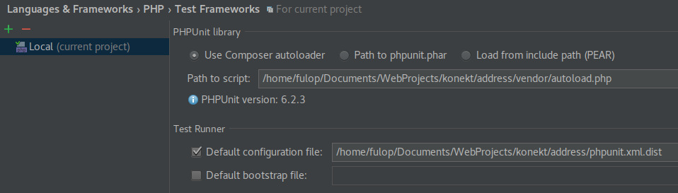
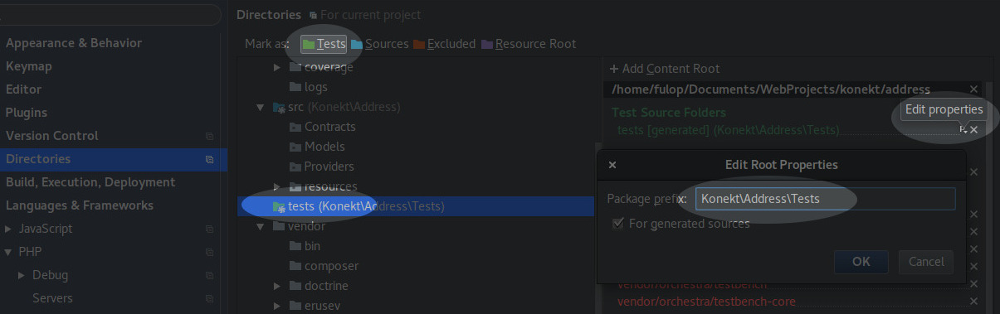

# Testing

Make sure to run `composer install` first!

#### Command Line

```bash
vendor/bin/phpunit -c phpunit.xml tests/
```

#### PhpStorm

> Based on PhpStorm 2017.2

1. Set the project interpreter (php >= 7.0) Settings -> Languages & Frameworks -> PHP: CLI Interpreter
2. Configure PHPUnit: Settings -> Languages & Frameworks -> PHP -> Test Frameworks:
    - Add or Edit PHPUnit Local,
    - Use Composer Autoloader
    - Path to script: `<path_to_this_folder>/vendor/autoload.php`
    - Default configuration file: `<path_to_this_folder>/phpunit.xml`
3. Mark directory: Settings -> Directories:
    - Mark `tests` folder as test
    - [optional]: On the right sidebar edit properties and set package prefix to `Konekt\Address\Tests`

**Example:**



